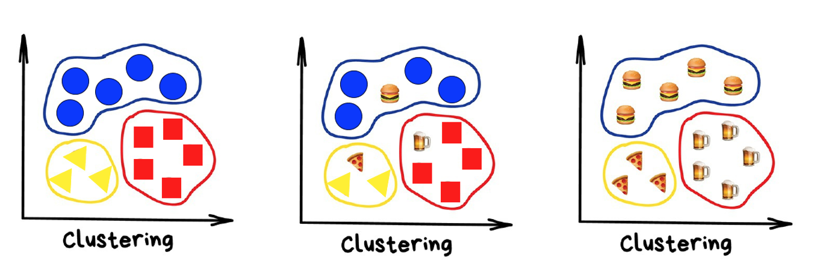

<br>

# Análise de Correlação Canônica

<br>

O termo correlação se refere ao relacionamento entre variáveis e é medida pelo coeficiente de correlação. A **correlação simples** mede o grau de associação linear entre duas variáveis ($r_{xy}$). A **correlação parcial** mede o grau de associação linear entre duas variáveis mantendo-se outras variáveis constantes. A ordem da correlação parcial vai depender do número de variáveis que ficam constantes. Com uma variável constante ($r_{xy.z}$) Z, a correlação parcial de x e y é dita de ordem um. A **correlação múltipla** mede o grau de associação entre uma variável e um conjunto de variáveis ($r_{x_1.x_2 x_3 \dots x_p}$). A **correlação canônica** mede o grau de associação entre dois grupos de variáveis, com um grupo denotado normalmente por Y e o outro por X. Estatiscamente, a correlação canônica procura testar se os dois conjuntos de variáveis são independentes. 

É uma técnica de Análise Multivariada usada para quantificar o grau de correlação (dependência) entre dois grupos de variáveis. Exemplos:

a) Correlação entre Variáveis Econômicas e Variáveis Sociais
b) Correlação entre Variáveis Tecnológicas e Variáveis Econômicas
c) Correlação entre Variáveis Econômicas e Variáveis Ambientais
d) Correlação entre Variáveis de Habilidade Matemática e Variáveis de Habilidade de Escrita
e) Correlação entre Variáveis de Características do Trabalho e Variáveis de Satisfação no Trabalho

Um exemplo disponível no site da UCLA (https://stats.oarc.ucla.edu/r/dae/canonical-correlation-analysis/) mostra que uma pesquisadora coletou dados sobre três variáveis psicológicas, quatro variáveis acadêmicas (resultados de testes padronizados) e gênero para 600 calouros universitários. Ela está interessada em como o conjunto de variáveis psicológicas se relaciona com as variáveis acadêmicas e de gênero. Em particular, a pesquisadora está interessada em quantas dimensões (variáveis canônicas) são necessárias para entender a associação entre os dois conjuntos de variáveis.

O arquivo de dados (mmreg.csv), possui 600 observações em oito variáveis. As variáveis psicológicas são locus_of_control, auto_conceito e motivação. As variáveis acadêmicas são testes padronizados em leitura (read), escrita (write), matemática (math) e ciências (science). Além disso, a variável female é uma variável binária (zero-um) com 1 para a estudante do sexo feminino.

<br>

## Entrada Dados da Correlação Canônica no R

<br>

```  {r estat1, warning=FALSE, message=FALSE}

#Pacotes utilizados
library(tidyverse)
library(skimr)
library(ggplot2)
library(GGally)
library(CCA)
library(CCP)
library(psych)

dados <- read.csv("https://stats.idre.ucla.edu/stat/data/mmreg.csv")
colnames(dados) <- c("Control", "Concept", "Motivation", "Read", "Write", "Math", 
    "Science", "Gender")

attach(dados)

#Visualizaçao dos dados
glimpse(dados)

head(dados)

tail(dados)

#Estatistica descritiva dos dados
summary(dados)

skim(dados)
```

<br>

Abaixo está uma lista de alguns métodos de análise que podem ser usadas com estes dados: 

a) Análise de correlação canônica;

b) Regressões simples separadas – analisar esses dados usando análises de regressão simples separadas para cada variável em um conjunto. As regressões não produzirão resultados multivariados e não relatam informações relativas à dimensionalidade;

c) A regressão múltipla multivariada.


<br>

Os dados para análise de correlações canônicas são formados por dois conjuntos de variáveis, formando dois vetores de variáveis X e Y, que podem ser organizados como demonstrado abaixo.  


| OBS    |   |    |      X  |    |    |    |    Y    |    |
|:------:|:---:|:---:|:---:|:------:|:---:|:---:|:---:|:---:|
|        | X1 | X2 | \.\.\. | XP | Y1 | Y2 | \.\.\. | YP |
| 1      |    |    |        |    |    |    |        |    |
| 2      |    |    |        |    |    |    |        |    |
| 3      |    |    |        |    |    |    |        |    |
| 4      |    |    |        |    |    |    |        |    |
| \.\.\. |    |    |        |    |    |    |        |    |
| N      |


com estes dados pode-se ter uma matriz de correlaçoes dada por 

$$
\mathbf{R}=\left[\begin{array}{ccc}
                R_{11} & \vdots & R_{12}  \\
                \dots & \vdots & \dots \\
                R_{21} & \vdots & R_{22}  \\
                \end{array} \right]
$$

que pode ser particionada em 4 partes onde $R_{11}$ é uma matriz de correlações do primeiro grupo; $R_{22}$ é uma matriz de correlações do segundo grupo; e $R_{12}$ e $R_{21}$ são correlações entre as variáveis de um grupo com as do outro grupo, sendo que uma é a transposta da outra. 

<br>

## Verificação das Correlações no R

<br>

```  {r estat2, warning=FALSE, message=FALSE}

psych <- dados[, 1:3]
acad <- dados[, 4:8]

ggpairs(psych)
ggpairs(acad)

# Correlações entre os dois conjuntos de variáveis
matcor(psych, acad)

```

<br>

A matriz $R_{12}$ mostra as correlações entre as variáveis dos dois grupos. Com p variáveis no vetor X e q variáveis no vetor Y tem-se pq correlações. A análise do relacionamento entre os dois grupos de variáveis por meio das pq correlações é inviável. O objetivo da **Análise de Correlação Canônica** é resumir o padrão de associação entre os X’s e os Y’s em termos de poucas correlações.

A idéia básica da técnica é:

a) Calcula-se, inicialmente, 2 combinações lineares, uma de cada conjunto de variáveis, de forma que a correlação entre elas seja máxima. As combinações lineares são denominadas *variáveis canônicas* e os pares são denominados *pares canônicos*. O primeiro par deve apresentar a maior correlação entre as variáveis canônicas;

b) Em seguida, calcula-se 2 outras variáveis canônicas, ou seja, outro par canônico, com a condição de serem ortogonais às primeiras e terem o máximo coeficiente de correlação. O segundo par deve ter a segunda maior correlação entre as variáveis canônicas.

c) Assim, sucessivamente.

Em geral, o número de dimensões canônicas (pares canônicos) é igual ao número de variáveis no conjunto menor $min(p,q)$. No entanto, o número de dimensões significativas pode ser ainda menor. O *coeficiente de correlação canônica* é o coeficiente de correlação de Pearson, em valor absoluto, entre as variáveis canônicas de cada par canônico. Existem, então, $k=min(p,q)$ pares canônicos e k coeficientes de correlação canônica sendo interpretados somente aqueles estatísticamente significativos.

Sejam $U_1$ e $V_1$ o primeiro par canônico, dado por

\begin{cases}
U_1=a_{11}X_1+a_{21}X_2+a_{31}X_3+ \dots +a_{p1}X_p \\
V_1=b_{11}Y_1+b_{21}Y_2+b_{31}Y_3+ \dots +b_{q1}Y_q \\
\end{cases}

o problema passa a ser encontrar os vetores $a_1$ e $b_1$ que maximizem a correlação entre $U_1$ e $V_1$.

Sejam $U_2$ e $V_2$ o segundo par canônico, dado por

\begin{cases}
U_2=a_{12}X_1+a_{22}X_2+a_{32}X_3+ \dots +a_{p2}X_p \\
V_2=b_{12}Y_1+b_{22}Y_2+b_{32}Y_3+ \dots +b_{q2}Y_q \\
\end{cases}

o problema passa a ser agora encontrar os vetores $a_2$ e $b_2$ que maximizem a correlação entre $U_2$ e $V_2$ e mantenha a condição de ortogonalidade entre $U_1$ e $U_2$ e entre $V_1$ e $V_2$.

<br>

## Solução Geral da Correlação Canônica

<br>

Considerando as variáveis padronizadas, que é o mesmo que trabalhar com a matriz de correlações, tem-se que combinações lineares das variáveis X são dadas por $U=a'X$, com $var(U)=var(a'X)=a'R_{11}a$ e combinações lineares de Y são dadas por $V=b'Y$, com $var(V)=var(b'Y)=b'R_{22}b$ e $cov(U,Y)=cov(a'X,b'Y)=a'R_{12}b$.

Sendo 

$$
r_{UV}=\frac{COV(U,V)}{\sqrt{var(U)}\sqrt{var(V)}}
$$

pode-se definir $r_{UV}^2$ como 

$$
r_{UV}^2=\frac{[COV(U,V)]^2}{var(U) var(V)}=\frac{(a'R_{12}b)^2}{(a'R_{11}a)(b'R_{22}b)}
$$

Assim, o problema pode ser definido como 

$$
maximizar \quad (a'R_{12}b)
$$

sujeito a

$$
a'R_{11}a=1 
$$
$$
b'R_{22}b=1 
$$
$$
a'R_{11}a^*=0 \quad a \neq a^* 
$$
$$
b'R_{22}b^*=0 \quad b \neq b^*  
$$

Resumidamente, o problema de maximização condicionado encontra os valores de $a_k$ e $b_k$ como soluções do seguinte sistema de equações

\begin{cases}
(R_{12}R_{22}^{-1}R_{21}-\lambda_k R_{11})a_k=0 \\
(R_{21}R_{11}^{-1}R_{12}-\lambda_k R_{22})b_k=0 \\
\end{cases}

em que $\lambda_k$ são raízes características e $a_k$ e $b_k$ são vetores característicos. Assim, os $\lambda_k$ satisfazem as seguintes equações características

\begin{cases}
|R_{12}R_{22}^{-1}R_{21}-\lambda_k R_{11}|=0 \\
|R_{21}R_{11}^{-1}R_{12}-\lambda_k R_{22}|=0 \\
\end{cases}

ou

\begin{cases}
|R_{11}^{-1}R_{12}R_{22}^{-1}R_{21}-\lambda_k I|=0 \\
|R_{22}^{-1}R_{21}R_{11}^{-1}R_{12}-\lambda_k I|=0 \\
\end{cases}

em que, $\lambda_k$ é a k-ésima maior raiz característica da matriz $R_{11}^{-1}R_{12}R_{22}^{-1}R_{21}$ ou da matriz $$R_{22}^{-1}R_{21}R_{11}^{-1}R_{12}$$.

O vetor "a" é o vetor característico da matriz $R_{11}^{-1}R_{12}R_{22}^{-1}R_{21}$ 

Dado "a", o vetor "b" pode ser obtido pela relação $b=\frac{1}{\sqrt{\lambda}}R_{22}^{-1}R_{21}a$.

O vetor "b" pode ser obtido pelas raízes características da matriz $R_{22}^{-1}R_{21}R_{11}^{-1}R_{12}$.

De forma semelhante, dado "b", o vetor "a" pode ser calculado por $a=\frac{1}{\sqrt{\lambda}}R_{11}^{-1}R_{12}b$.

As soluções para as raízes de $R_{11}^{-1}R_{12}R_{22}^{-1}R_{21}$ ou de $$R_{22}^{-1}R_{21}R_{11}^{-1}R_{12}$$ são idênticas.


Tem-se, assim, a solução para os coeficientes das variáveis canônicas que são os elementos dos vetores “a” e “b”. Observe que:

a) As raízes podem ser calculadas com base em equações características diferentes

\begin{cases}
|R_{11}^{-1}R_{12}R_{22}^{-1}R_{21}-\lambda_k I|=0 \\
|R_{22}^{-1}R_{21}R_{11}^{-1}R_{12}-\lambda_k I|=0 \\
\end{cases}

b) Para cada raiz existe um par de vetores cujos elementos são os coeficientes das variáveis canônicas. Estes coeficientes são chamados pesos canônicos e podem ser calculados na forma bruta ou padronizada.

c) O coeficiente de correlação canônica é o coeficiente de correlação, em valor absoluto, entre $U_k$ e $V_k$. Ele é igual a raiz quadrada da raiz característica, ou seja, $r_1=\sqrt{\lambda_1}$, $r_2=\sqrt{\lambda_2}$, etc. 

<br>

## Análise da Correlação Canônica no R

<br>

```  {r estat3, warning=FALSE, message=FALSE}

# Calcular e mostrar as correlaçoes canônicas
cc1 <- cc(psych, acad)
cc1$cor #mostra as correlaçoes
cc1[3:4] #mostra os coeficientes canônicos brutos
```

A dimensão 1 teve uma correlação canônica de 0,46 entre os conjuntos de variáveis, enquanto para a dimensão 2 a correlação canônica foi bem menor em 0,17. A correlação canônica da terceira dimensão foi 0,10.

Os coeficientes canônicos brutos são interpretados da mesma forma que os coeficientes da análise de regressão, ou seja, para a variável read, um aumento de uma unidade leva a uma diminuição de 0,0446 na primeira variável canônica do segundo conjunto de dados, tudo o mais constante. Outro exemplo: ser mulher leva a uma diminuição de 0,6321 na dimensão 1 para o conjunto de dados "acadêmico" com tudo mais constante.

```  {r estat4, warning=FALSE, message=FALSE}

# Calcular as cargas canônicas
cc2 <- comput(psych, acad, cc1)

# Mostrar as cargas canônicas
cc2[3:6]
```

As correlações acima são entre variáveis observadas e variáveis canônicas que são conhecidas como cargas canônicas. Essas variáveis canônicas são na verdade um tipo de variável latente, ou seja, não observadas. À semelhança da interpretação dos fatores na Análise Fatorial, as variáveis canônicas podem ser identificadas em termos das variáveis com que elas mais se relacionam. Isto pode ser feito por meio dos coeficientes canônicos ou pesos canônicos ou, preferencialmente, através das correlações entre a variável canônica e as variáveis originais. Estas correlações são denominadas cargas canônicas (canonical loadings) ou correlações estruturais. Por exemplo, se $U_1$ e $X_1$ são positiva e altamente correlacionadas, $U_1$ pode ser considerada um reflexo de $X_1$. Da mesma forma, se $V_1$ for negativa e altamente correlacionada com $Y_1$ e positiva e altamente correlacionada com $Y_3$, então $V_1$ reflete $Y_1$ em sentido contrário e $Y_3$ no mesmo sentido.

São calculados coeficientes de correlação entre as variáveis canônicas e as variáveis originais padronizadas de forma que se tenha os coeficientes de correlação entre as variáveis canônicas U e as variáveis do grupo X; entre as variáveis canônicas U e as variáveis do grupo Y; entre as variáveis canônicas V e as variáveis do grupo Y e entre as variáveis canônicas V e as variáveis do grupo X. 

Quando as variáveis do modelo possuem desvios padrão muito diferentes, os coeficientes padronizados permitem comparações mais fáceis entre as variáveis, calculados como demonstrado abaixo.

```  {r estat5, warning=FALSE, message=FALSE}

# coeficientes canonicos padronizados para  psych (desvio padrao da diagonal da matriz de var-cov de psych)
s1 <- diag(sqrt(diag(cov(psych))))
s1 %*% cc1$xcoef

# coeficientes canonicos padronizados para  acad (desvio padrao da diagonal da matriz de var-cov de acad)
s2 <- diag(sqrt(diag(cov(acad))))
s2 %*% cc1$ycoef
```

Os coeficientes canônicos padronizados são interpretados de maneira semelhante à interpretação dos coeficientes de analise de regressão com variáveis padronizadas. Por exemplo, considere a variável *read*, um aumento de um desvio padrão em *read* leva a uma diminuição de 0,45 desvio padrão na pontuação na primeira variável canônica para o segundo conjunto de dados, tudo mais constante.

Para as variáveis psicológicas, a primeira dimensão canônica é mais fortemente influenciada pelo locus de controle (Control) (-0,84) e, para a segunda dimensão, autoconceito (Concept) (-0,84) e motivação (Motivation) (0,69). Para as variáveis acadêmicas mais gênero, a primeira dimensão foi composta por leitura  (reading) (-0,45), escrita (writing) (-0,35) e gênero (gender) (-0,32). Para a segunda dimensão, escrita (writing) (0,41), ciência (science) (-0,83) e gênero (gender) (0,54) foram as variáveis dominantes.

Calculados os vetores de coeficientes a e b e os coeficientes de correlação canônica os próximos passos consistem em realizar e interpretar os testes de hipóteses sobre o número de dimensões canônicas. As fórmulas para cálculo podem ser encontradas nas referencias do pacote CCP (https://cran.r-project.org/web/packages/CCP/CCP.pdf)

```  {r estat6, warning=FALSE, message=FALSE}

# testes de dimensões canonicas
rho <- cc1$cor

## Define o numero de observações, numero de variaveis do primeiro grupo e de variáveis do segundo conjunto de variáveis.

n <- dim(psych)[1]
p <- length(psych)
q <- length(acad)

## Calcula os p-values de diferentes testes estatísticos:
p.asym(rho, n, p, q, tstat = "Wilks")
p.asym(rho, n, p, q, tstat = "Hotelling")
p.asym(rho, n, p, q, tstat = "Pillai")
```

Conforme mostrado na tabela acima, o primeiro teste das dimensões canônicas testa se todas as três dimensões são significativas (elas são, F = 11,72). O próximo teste verifica se as dimensões 2 e 3 combinadas são significativas (elas são, F = 2,94). Por fim, o último teste analisa se a dimensão 3, por si só, é significativa (não é). Portanto, as dimensões 1 e 2 devem ser significativas, enquanto a dimensão três não é.

Um outro exemplo é de dados de uma amostra de 50 funcionários de uma firma que procura aperfeiçoar testes que podem revelar o potencial para vendas. Foram avaliadas 3 medidas de performance: $X_1$= aumento de vendas; $X_2$= rendimento das vendas, e $X_3$= vendas para novos clientes. Essas medidas foram transformadas para uma escala em que 100 indica performance média. Cada indivíduo foi submetido a 4 testes com o objetivo de medir criatividade, raciocínio mecânico, raciocínio abstrato e habilidade matemática. As notas destes testes formam as variáveis: $Y_1$= nota no teste de criatividade; $Y_2$= nota no teste de raciocínio mecânico; $Y_3$= nota no teste de raciocínio abstrato, e $Y_4$= nota no teste de habilidade matemática (Johnson e Wichern, 2007, p. 536). Este exemplo é semelhante ao de Mingoti (2005, p. 146).

```  {r estat7, warning=FALSE, message=FALSE}
# Pacotes
library(tidyverse)

# Direcionado o R para o Diretorio a ser trabalhado
setwd('/Users/jricardofl/Dropbox/tempecon/multivariada')

# Entrada dos dados
dados <- read.csv2("vendedor.csv", header=TRUE, sep=";", dec=".")
dados <- dados[,-1] #retira a primeira coluna

#attach(dados)

#Visualizaçao dos dados
glimpse(dados)
head(dados)
tail(dados)

#Estatistica descritiva dos dados
summary(dados)

skim(dados)

#Correlações entre os dados
perform <- dados %>% 
  dplyr::select(X1, X2, X3) %>%
  scale() %>% as_tibble

testes <- dados %>% 
  dplyr::select(Y1, Y2, Y3, Y4) %>%
  scale() %>% as_tibble

ggpairs(perform)
ggpairs(testes)
matcor(perform, testes)
```

<br>

# Análise de Agrupamentos (Cluster)

<br>

Segundo Mingoti (2005, p.155), "a Análise de Agrupamentos, também conhecida como Análise de Conglomerados, Classificação ou Cluster, tem como objetivo dividir os elementos da amostra, ou população, em grupos de forma que os elementos pertencentes a um mesmo grupo sejam similares entre si com respeito às variáveis (características) que neles foram medidas, e os elementos em grupos diferentes sejam heterogêneos em relação a estas mesmas características". 

Assim, a idéia básica é maximizar a homogeneidade dentro dos grupos ao mesmo tempo em que se maximiza a heterogeneidade entre os grupos. Para formar grupos de objetos tem-se que medir e comparar a semelhança entre eles. A medida de semelhança fica dificultada quando se considera várias variáveis (características).

No processo de agrupamento, primeiro o conjunto de dados será dividido em grupos com elementos parecidos entre si e diferentes dos outros grupos. Depois os grupos encontrados serão analisados até que efetivamente se encontre a existência de padrões entre eles.

{width=100%}


No caso univariado  é possível que apenas uma análise visual ou gráfica dos dados seja suficiente para decidir sobre os agrupamentos de observaçoes. Contudo, isto não é muito mais difícil quando se tem um conjunto maior de variáveis. Para realizar as técnicas de cluster é necessário definir o conceito de distância.

<br>

## Etapas da Análise de Cluster

<br>

I) Escolher um critério de parecença (similaridade ou dissimilaridade);

II) Formação dos grupos (escolher o algoritmo de agrupamento);

III) Definição de número de grupos: pode ser a posteriori, como resultado da Análise ou a priori, dado o conhecimento ou conveniência da Análise;

IV) Validação do agrupamento: critério do pesquisador;

V) Interpretação e Análise: pode-se fazer estatística descritiva, diferença de médias, etc.

<br>

## Medidas de Parecença

<br>

Valor numérico que quantifica o grau de semelhança entre um par de objetos. Pode ser de dois tipos: similaridade ou dissimilaridade. Para variáveis quantitativas, quando se buscas agrupar observações as distâncias são as mais usadas. São medidas de **dissimilaridade** entre objetos. O coeficiente de distância assume valor máximo para objetos totalmente diferentes e valor zero para dois objetos idênticos considerando todas as variáveis. 

Em algumas aplicações deseja-se agrupar variáveis ao invés de observações. Neste caso, o coeficiente de correlação de Pearson é mais comumente utilizado. No caso de variáveis binárias, os dados são novamente rearranjados na forma de uma
tabela de contigência, com as variáveis formando as categorias.

Os coeficientes de distância mais comuns têm as seguintes propriedades:

I) *Mínimo Zero*: Se $A=B$, então $D(A,B)=0$;

II) *Positividade*: Se $A \neq B$, então $D(A,B)>0$;

III) *Simetria*: $D(A,B) = D(B,A)$

IV) *Desigualdade triangular*: $D(A,B)+D(B,C) \geq D(A,C)$

Em relação às distâncias sabe-se pelo Teorema de Pitágoras que $c^2=a^2+b^2$, assim, $c=\sqrt{a^2+b^2}$, que é a  **Distância Euclidiana**  entre dois pontos (A e B). Em termos de variáveis, tem-se:

$$
D_{AB}=\sqrt{(X_{2A}-X_{2B})^2+(X_{1B}-X_{1A})^2}
$$
matricialmente, a Distância Euclidiana é definida por $D_{AB}=\sqrt{(X_a-X_b)'(X_a-X_b)}$ e possui as seguintes propriedades:

a) Base geométrica bem definida;

b) Invariante com relação à transformação de origem;

c) Invariante com relação à transformação ortogonal; 

d) Não invariante com relação à transformação de escala;

e) Não invariante com relação à transformação não ortogonal.


A **Distância Euclidiana Quadrática** é dada por

$$
D_{AB}^2=\sum_{j=1}^p(x_{ja}-x_{jb})^2
$$

A **Distância Euclidiana Ponderada** é definida por

$$
D_{AB}=\sqrt{(X_a-X_b)'A(X_a-X_b)}
$$

com A sendo uma matriz de ponderação (pesos diferentes de acordo com a variância das variáveis). Se $A=I$, $D_{AB}$ é a **Distância Euclidiana**. Se $A=S^{-1}$, ou seja, inverso da matriz var-cov, tem-se a **Distância de Mahalanobis**.

Se $A=diag(S_i^2)^{-1}$, em que $S_i^2$ é a variância amostral da i-ésima variável aleatória, leva-se em consideração na ponderação apenas as diferenças de variâncias das variáveis.

Se $A=diag(1/p)$ tem-se a Distância Euclidiana Média;

A **Distância de Minkowsky** é dada por 

$$
D_{AB}=\Big [\sum_i^p w_i | X_{ia} - X_{ib}| ^\lambda  \Big]^{\frac{1}{\lambda}}
$$

onde $w_i$ são pesos de ponderação para as variáveis. Se $\lambda=2$, tem-se a **Distância Euclidiana**. Esta distância é menos afetada pela presença de valores discrepantes numa amostra do que a distância Euclidiana. Se $\lambda=1$, tem-se a **Distância city-block** também conhecida como **Manhattan**.

Para observações representadas através de variáveis qualitativas, é necessária a criação de variáveis binárias, as quais assumem o valor 1 se uma característica de interesse está presente, e 0, caso contrário. Dessa forma, para um par de observações (i; k) medidos através de p variáveis binárias, considere a seguinte Tabela de Contigência:

|              |       | Observação k |     |           |
|:------------:|:-----:|:------------:|:---:|:---------:|
|              |       | 1            | 0   | Total     |
| Observação i | 1     | a            | b   | a+b       |
|              | 0     | c            | d   | c+d       |
|              | Total | a+c          | b+d | p=a+b+c+d |


com base nesta tabela é possível listar algumas medidas de similaridade e a idéia básica de cada uma delas. 

|              |       | 
|:------------:|:-----|
| $\frac{a+d}{p}$  |Pesos iguais para pares 1-1 e 0-0   |
| $\frac{2(a+d)}{2(a+d)+b+c}$ |  Peso em dobro para pares 1-1 e 0-0 |
| $\frac{a+d}{a+d+2(b+c)}$  |  Peso em dobro para pares descasados |
| $\frac{a}{p}$ | Sem pares 0-0 no numerador |
| $\frac{a}{a+b+c}$  | Sem pares 0-0 no numerador e no denominador  |
| $\frac{2a}{2a+b+c}$  | Sem pares 0 - 0 no numerador e no denominador.|
|   | Peso em dobro para pares 1 - 1.    |
| $\frac{a}{a+2(b+c)}$  |  Sem pares 0 - 0 no numerador e no denominador. |
|   | Peso em dobro para pares descasados.  |
| $\frac{a}{b+c}$  | Razão entre pares 1 - 1 e pares descasados. |

Organiza-se a tabela de contingência e calcula-se o coeficiente de similaridade para cada par de observações. Os coeficientes são dispostos em uma matriz simétrica n x n denominada **matriz de similaridade**.

<br>

## Técnicas para construção de Conglomerados (Clusters)

<br>

Para Mingoti (2005, p.164), "as técnicas de conglomerados ou clusters são frequentemente classificadas em dois tipos: técnicas hierárquicas e não hierárquicas, sendo que as hierárquicas são classificadas em aglomerativas e divisivas".

Os **Métodos hierárquicos aglomerativos** partem do princípio de que no início do processo de agrupamento têm-se n conglomerados (cada elemento é um conglomerado). Em cada passo do algoritmo, os elementos vão sendo agrupados, formando novos conglomerados até o ponto em que todos os elementos estão num único grupo.

Em termos de variabilidade, no estágio inicial é a menor possível e no final, a máxima possível, pois todos os elementos estão agrupados em apenas 1 cluster. Se dois elementos aparecem juntos num mesmo grupo em algum estçgio do processo de agrupamento, permanecerão juntos até o final, ou seja, não podem mais ser separados.

Devido a esta propriedade, denominada hierarquia, se pode construiu o **Dendograma**. Dendograma é um gráfico em forma de árvore no qual a escala vertical indica o nível de similaridade (ou dissimilaridade). No eixo horizontal tem-se os elementos e no vertical a altura correspondente ao nível em que os elementos foram considerados semelhantes. Quanto maior a altura maior a variabilidade, ou seja, maior a heterogeneidade dos grupos a serem unidos.

A outra técnica de construção dos clusters é chamada de **Método hierárquivo Divisivo**,  que se inicia com todos os objetos em um grupo; formam-se subgrupos desagregando os grupos formados até terminar com cada objeto formando um grupo.

Existem ainda os **Métodos não hierárquicos, também denominados de métodos de partição**. Inicia-se com um número pré definido de grupos e a cada passo procura-se realocar os objetos de maneira a encontrar a melhor partição, isto é, a que minimiza a variância dentro do grupo e maximiza a variância entre grupos. Os métodos não hierárquicos não geram dendrograma, são aplicados a casos (observações) e não a variáveis e são mais indicados para amostras grandes.

<br>

## Métodos de agrupamento

<br>

I) **Método de ligação simples**: também denominado de vizinho mais próximo ou *single linkage*. A similaridade entre dois grupos é definida pelos elementos mais parecidos. É a distância entre os vizinhos mais próximos ou entre os elementos mais parecidos de cada conglomerado.

$$
D_{I,II} = min \quad ({d_{ij}, i \in I, j \in II})
$$

II) **Método de ligação completa ou do vizinho mais distante**: A similaridade entre dois grupos é definida pelos elementos que são "menos semelhantes" entre si. Em cada passo do algoritmo são combinados os elementos que apresentarem o menor valor máximo de distância.


$$
D_{I,II} = max \quad ({d_{ij}, i \in I, j \in II})
$$

III) **Método da média das distâncias** (*average linkage*): Considera a distância entre dois grupos como a média das distâncias entre todos os pares de elementos dos dois grupos que estão sendo comparados.

$$
D_{i,j}=\frac{\sum_{i=1}^{n_I} \sum_{j=1}^{n_{II}}d_{ij}}{n_I n_{II}}
$$

IV) **Método dos centróides**: A distância entre dois grupos é definida como sendo a distância entre os vetores de médias (centróides), dos grupos comparados. É a distância Euclidiana quadrática entre os vetores de médias amostrais.

$$
D_{AB}=(\bar X_a - \bar X_b)'(\bar X_a - \bar X_b)
$$

V) **Método de Ward**: No processo aglomerativo a medida que se agrupa o nível de similaridade diminui. Em cada passo do agrupamento ocorre diminuição de variabilidade entre grupos e aumento dentro dos grupos. O método de Ward se baseia na mudança de variação que ocorre de um estágio para outro. Este método tende a formar grupos com maior homogeneidade interna. O método considera o aumento na soma de quadrados dos erros como critério para juntar dois grupos. Para um dado grupo g, a soma de quadrados dos erros, $SQE_g$, é a soma dos desvios ao quadrado de cada item para a média do grupo (centróide). 

Em um estágio com G grupos, define-se $SQE$ como a soma $SQE=SQE_1+SQE_2+SQE_3+ \dots SQE_G$. Quando se junta dois grupos, SQE aumenta. Em cada etapa, a união de todos os pares de grupos é analisada. Junta-se os dois grupos que resultam no menor aumento de $SQE$

Segundo Mingoti (2005), "os métodos de ligação simples, completa e da média podem ser utilizados tanto para variáveis quantitativas, quanto qualitativas, ao contrário dos métodos do centróide e de Ward que são apropriados apenas para variáveis quantitativas, já que têm como base a comparação de vetores de médias".

<br>

## Análise de Conglomerados (Clusters) no R - Método Hieráquico

<br>


```  {r estat8, warning=FALSE, message=FALSE}
#Direcionado o R para o Diretorio a ser trabalhado
setwd('/Users/jricardofl/Dropbox/tempecon/dados_gescilene')

#Lendo os dados no R
library(foreign)
library(car)
library(tidyverse)
#library(Rcmdr)
library(corrplot)
library(MVar.pt)
library(cluster)
library(clValid) # Avaliação dos grupos
library(e1071) # Fuzzy K-médias
library(factoextra) # Vizualização de grupos
library(gridExtra) # Ferramentas gráficas
library(ggforce) # Ferramentas gráficas

#Entrada de Dados
dados <- read.dta("dados_gesc.dta")
str(dados)

# Nomes das Variáveis utilizadas 
#x1 Idade
#x2	Escolaridade
#x3	Renda Bruta Total
#x4 Produtividade
#x5 Valor total anual  de mão de obra permanente
#x6	Valor Total com custo anual com insumos agrícolas nas ativ. Irrig. em 2014
#x7	Custo com energia eletrica e agua
#x8 Capital total empregado na ativ irrig em 2014
#x9	N total de empregados
#x10 Indice de introducao de inovacao (III)
#x11 Indice de Inovacoes realizadas (II)
#x12 Gastos para desenvolver as atividade de inovacao sobre faturamento de 2014
#x13 Quantidade de tecnologia agricola utilizada na atividade irrigada	
#x14 Dummy se a empresa realizou atividades de treinamento e capacitacao de recursos humanos entre 2010 a 2014
#x15 Indice de Fonte de Informacao
#x16 Dummy se empresa esteve envolvida em atividades cooperativas entre os anos de 2010 e 2014
#####################################################

#dados <- dados1 %>% select(-x14, -x16)
dados <- dados[,-c(14,16)]

#Se quiser padronizar os dados
dados.pad <-as.data.frame(scale(dados))

#Analise Fatorial
fatorial1 <- factanal(dados.pad, factors=4, rotation="none", na.action=na.omit)
fatorial2 <- factanal(dados.pad, factors=4, rotation="varimax", na.action=na.omit, scores = c("regression"))

#Analise de Cluster
# Função que obtém o WSS para o método hierárquico
# NÃO MUDAR!
get_wss <- function(d, cluster){
  d <- stats::as.dist(d)
  cn <- max(cluster)
  clusterf <- as.factor(cluster)
  clusterl <- levels(clusterf)
  cnn <- length(clusterl)
  
  if (cn != cnn) {
    warning("cluster renumbered because maximum != number of clusters")
    for (i in 1:cnn) cluster[clusterf == clusterl[i]] <- i
    cn <- cnn
  }
  cwn <- cn
  # Compute total within sum of square
  dmat <- as.matrix(d)
  within.cluster.ss <- 0
  for (i in 1:cn) {
    cluster.size <- sum(cluster == i)
    di <- as.dist(dmat[cluster == i, cluster == i])
    within.cluster.ss <- within.cluster.ss + sum(di^2)/cluster.size
  }
  within.cluster.ss
}

# Função que constrói o "gráfico do cotovelo" e aponta o K ótimo
# NÃO MUDAR!
elbow.plot <- function(x, kmax = 15, alg = "kmeans") {
  # alg = c("kmeans", "cmeans", "hclust")
  wss <- c()
  if (alg == "kmeans") {
    for (i in 1:kmax) {
      set.seed(13)
      tmp <- kmeans(x, i)
      # wss[i] <- get_wss(dist(x), tmp$cluster)
      wss[i] <- tmp$tot.withinss
    }
    tmp <- data.frame(k = 1:kmax, wss)
    max_k <- max(tmp$k)
    max_k_wss <- tmp$wss[which.max(tmp$k)]
    max_wss <- max(tmp$wss)
    max_wss_k <- tmp$k[which.max(tmp$wss)]
    max_df <- data.frame(x = c(max_wss_k, max_k), y = c(max_wss, max_k_wss))
    tmp_lm <- lm(max_df$y ~ max_df$x)
    d <- c()
    for(i in 1:kmax) {
      d <- c(d, abs(coef(tmp_lm)[2]*i - tmp$wss[i] + coef(tmp_lm)[1]) /
               sqrt(coef(tmp_lm)[2]^2 + 1^2))
    }
    tmp$d <- d
    ggplot(data = tmp, aes(k, wss)) +
      geom_line() +
      geom_segment(aes(x = k[1], y = wss[1],
                       xend = max(k), yend = wss[which.max(k)]),
                   linetype = "dashed") +
      geom_point(aes(size = (d == max(d)), color = (d == max(d))),
                 show.legend = FALSE) +
      scale_size_manual(values = c(2,5)) +
      scale_color_manual(values = c("black", "red")) +
      labs(x = "Number of clusters",
           y = "Total within-cluster sum of squares",
           title = "Elbow plot for the K-means method") +
      theme_bw()
  }
  else if (alg == "cmeans") {
    for (i in 1:kmax) {
      if (i == 1) {
        wss[i] <- get_wss(dist(x), rep(1, nrow(x)))
      }
      else {
        set.seed(13)
        tmp <- cmeans(x, i)
        wss[i] <- get_wss(dist(x), tmp$cluster)
        # wss[i] <- tmp$sumsqrs$tot.within.ss
      }
    }
    tmp <- data.frame(k = 1:kmax, wss)
    max_k <- max(tmp$k)
    max_k_wss <- tmp$wss[which.max(tmp$k)]
    max_wss <- max(tmp$wss)
    max_wss_k <- tmp$k[which.max(tmp$wss)]
    max_df <- data.frame(x = c(max_wss_k, max_k), y = c(max_wss, max_k_wss))
    tmp_lm <- lm(max_df$y ~ max_df$x)
    d <- c()
    for(i in 1:kmax) {
      d <- c(d, abs(coef(tmp_lm)[2]*i - tmp$wss[i] + coef(tmp_lm)[1]) /
               sqrt(coef(tmp_lm)[2]^2 + 1^2))
    }
    tmp$d <- d
    ggplot(data = tmp, aes(k, wss)) +
      geom_line() +
      geom_segment(aes(x = k[1], y = wss[1],
                       xend = max(k), yend = wss[which.max(k)]),
                   linetype = "dashed") +
      geom_point(aes(size = (d == max(d)), color = (d == max(d))),
                 show.legend = FALSE) +
      scale_size_manual(values = c(2,5)) +
      scale_color_manual(values = c("black", "red")) +
      labs(x = "Number of clusters",
           y = "Total within-cluster sum of squares",
           title = "Elbow plot for the fuzzy K-means method") +
      theme_bw()
  }
  else if (alg == "hclust") {
    for (i in 1:kmax) {
      set.seed(13)
      tmp <- hcut(x, i)
      wss[i] <- get_wss(dist(x), tmp$cluster)
    }
    tmp <- data.frame(k = 1:kmax, wss)
    max_k <- max(tmp$k)
    max_k_wss <- tmp$wss[which.max(tmp$k)]
    max_wss <- max(tmp$wss)
    max_wss_k <- tmp$k[which.max(tmp$wss)]
    max_df <- data.frame(x = c(max_wss_k, max_k), y = c(max_wss, max_k_wss))
    tmp_lm <- lm(max_df$y ~ max_df$x)
    d <- c()
    for(i in 1:kmax) {
      d <- c(d, abs(coef(tmp_lm)[2]*i - tmp$wss[i] + coef(tmp_lm)[1]) /
               sqrt(coef(tmp_lm)[2]^2 + 1^2))
    }
    tmp$d <- d
    ggplot(data = tmp, aes(k, wss)) +
      geom_line() +
      geom_segment(aes(x = k[1], y = wss[1],
                       xend = max(k), yend = wss[which.max(k)]),
                   linetype = "dashed") +
      geom_point(aes(size = (d == max(d)), color = (d == max(d))),
                 show.legend = FALSE) +
      scale_size_manual(values = c(2,5)) +
      scale_color_manual(values = c("black", "red")) +
      labs(x = "Number of clusters",
           y = "Total within-cluster sum of squares",
           title = "Elbow plot for the hierarchical method") +
      theme_bw()
  }
}

# Função vizualização dos grupos
# NÃO MUDAR!
cluster_viz <- function(data, clusters, 
                        axes = c(1, 2), geom = c("point", "text"), repel = TRUE, 
                        show.clust.cent = TRUE, ellipse = TRUE, ellipse.type = "convex", 
                        ellipse.level = 0.95, ellipse.alpha = 0.2, shape = NULL, 
                        pointsize = 1.5, labelsize = 12, main = "Cluster plot",
                        ggtheme = theme_bw()) {
  require(factoextra)
  data <- scale(data)
  pca <- stats::prcomp(data, scale = FALSE, center = FALSE)
  ind <- facto_summarize(pca, element = "ind", result = "coord", axes = axes)
  eig <- get_eigenvalue(pca)[axes, 2]
  xlab <- paste0("Dim", axes[1], " (", round(eig[1], 1), "%)")
  ylab <- paste0("Dim", axes[2], " (", round(eig[2], 1), "%)")
  colnames(ind)[2:3] <- c("x", "y")
  label_coord <- ind
  lab <- NULL
  if ("text" %in% geom) 
    lab <- "name"
  if (is.null(shape)) 
    shape <- "cluster"
  plot.data <- cbind.data.frame(ind, cluster = clusters, stringsAsFactors = TRUE)
  label_coord <- cbind.data.frame(label_coord, cluster = clusters, stringsAsFactors = TRUE)
  p <- ggpubr::ggscatter(plot.data, "x", "y", color = "cluster", 
                         shape = shape, size = pointsize, point = "point" %in% geom,
                         label = lab, font.label = labelsize, repel = repel, 
                         mean.point = show.clust.cent, ellipse = ellipse, ellipse.type = ellipse.type, 
                         ellipse.alpha = ellipse.alpha, ellipse.level = ellipse.level, 
                         main = main, xlab = xlab, ylab = ylab, ggtheme = ggtheme)
  p
}

# Encontrar número ótimo de grupos para o método hierárquico
set.seed(123456789)
p3 <- elbow.plot(dados.pad, alg = "hclust")
p3

# K "ótimo" é igual a 4. Mudar de acordo com o seu resultado

d <-dist(dados.pad, method = "euclidean")
h.fit <-hclust(d, method = "ward.D")
plot(h.fit, main='Dendograma - Método Hierárquico', xlab='Cluster das Observações - Distância Euclidiana e Método de Ward', ylab='Altura')

groups_a <- cutree(h.fit, k=3)
groups_a 

groups_b <- cutree(h.fit, k=4)
groups_b 

groups_c <- cutree(h.fit, k=5)
dendogram3 <- rect.hclust(h.fit, k=5, border="red")
dendogram3

summary(fatorial2$scores)
attach(dados)
by(dados, groups_c, summary)

# Agrupamento usando o método hierárquico - 2 forma
nclust = 5 # Número de grupos de acordo com os gráficos
fit.hclust <- hcut(dados.pad, 5) # Ajustar K de acordo com o gráfico
fit.hclust

g_cluster <- cluster_viz(dados.pad, as.factor(fit.hclust$cluster), geom = "point", main = "Gráfico Cluster para o Método Hierárquico")
plot(g_cluster)

```

## Métodos Não-Hierárquicos

São métodos de partição de "n" objetos em "k" grupos. Os "k" grupos são pré-determinados. A cada passo verifica-se se os objetos estão alocados da "melhor" maneira. Função objetivo: procura minimizar a variância dentro do grupo e maximizar a variância entre os grupos. 

Não fornece dendograma. Isto porque se em algum passo do algoritmo dois elementos tiverem sido colocados num mesmo cluster, não necessariamente "estarão juntos" na partição final. Bom quando se tem um grande número de observações. O problema principal aqui não é o número de grupos e sim a melhor forma de alocar os elementos em k grupos. O método mais usado é o das k-médias (k-means).

Resumidamente, o método das k-means é composto de quatro passos. No primeiro são selecionados k centróides para inicializar o processo de partição. Cada elemento do conjunto de dados é, então, comparado com cada centróide inicial, através de uma medida de distância que, em geral, é a Euclidiana. O elemento é alocado ao grupo cuja distância é a menor. No terceiro passo, recalcula-se os valores dos centróides para cada novo grupo formado. Com estes novos centróides, repete-se o passo 2. Isto deve ser repetido até que nenhuma realocação de elementos seja necessária. 


```  {r estat9, warning=FALSE, message=FALSE}
cluster_kmeans <- elbow.plot(dados.pad)
cluster_kmeans

kmeans1 <- kmeans(dados.pad, centers=5)
#Centróides
kmeans1$centers

#Plot dos Clusters
clusplot(dados.pad, kmeans1$cluster, main="2D Representação da solução dos Clusters",
         color=TRUE, shade=TRUE, labels=2, lines=0)

# Agrupamento usando o K-means - 2 forma
fit.kmeans <- kmeans(dados.pad, 5) # Ajustar K de acordo com o gráfico
fit.kmeans
g_kmeans <- cluster_viz(dados.pad, as.factor(fit.kmeans$cluster), geom = "point",
                  main = "Gráfico Cluster para o Método K-médias")
plot(g_kmeans)
```

<br>