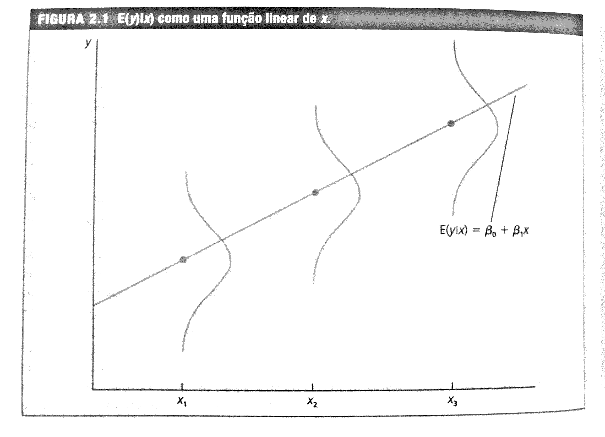

<br>

# Modelos de Regressão Simples

<br>

## Definição do Modelo de Regressão Simples

<br>

O modelo de regressão simples pode ser usado para estudar a relação entre duas variáveis. Em outras palavras, quando se pretender analisar como "y" varia quando "x" mudar;

Considere duas variáveis "y" e "x" que representam alguma população. A equação abaixo relaciona as duas variáveis:

$$
	y=\beta_0+\beta_1x+u
$$

A equação acima é válida para a população de interesse e chamada de **modelo de regressão linear simples**. Pode ser também chamada de regressão bivariada ou de duas variáveis.

Quando relacionadas como acima, as variáveis *x e *y* podem ser denominadas de diversas formas:

``` {r, include=FALSE}
#https://tableconvert.com/latex-to-markdown
```

<center>Tabela 1: Terminologia para a regressão simples: </center>


| Y                    | X                     |
|:--------------------:|:---------------------:|
| Variável Dependente  | Variável Independente |
| Variável Explicada   | Variável Explicativa  |
| Variável de Resposta | Variável de Controle  |
| Variável Prevista    | Variável Previsora    |
| Regressando          | Regressor             |
  

O termo covariável também pode ser usado para x. O mais comum é variável dependente e independente.

Se os outros fatores são fixos, sua variação é zero, ou seja, $\Delta u=0$. Assim, x tem um efeito linear sobre y:

$$
\Delta y=\beta_1 \Delta x \quad se \quad \Delta u=0
$$

A variação em y é, simplesmente, $\beta_1$ multiplicado pela variação em x. Isso significa que $\beta_1$ é o **parâmetro de inclinação** da relação entre y e x, mantendo fixos os fatores em u;


O **parâmetro de intercepto** $\beta_0$ é chamado de constante do modelo. 

O coeficiente de inclinação mede a taxa (parcial) da mudança no valor médio de y para uma mudança de uma unidade no valor da variável independente, tudo o mais constante; 

O termo de erro **u** representa todas aquelas variáveis que não podem estar explícitas no modelo por razões diversas. Contudo, se assume que a influência destas sobre o regressando é insignificante;

Pode-se entender o termo de erro como os fatores não observados que afetam y. 

<br>

## Hipóteses do Modelo Clássico de Regressão Linear

<br>

Em relação ao termo de erro, é necessário fazer uma hipótese que restrinja a relação dele com a variável independente (x);

Como u e x são variáveis aleatórias, pode-se definir a distribuição condicional de u dado qualquer valor de x. A hipótese para se estimar um modelo de regressão com betas confiáveis é 
		
$$
E(u|x)=E(u)=0
$$
		
O que está indicado na equação acima é que o valor médio de u é o mesmo para qualquer valor de x e igual a sua média aritmética. Em outras palavras, diz que u é **independente da média** de x. 

Considerando o valor esperado da equação de Y em função de X e usando $E(u|x)=0$, se obtém: 
		
$$
E(y|x)=\beta_0+\beta_1x
$$
		
A equação dada acima mostra que a **função de regressão populacional (FRP)**, $E(y|x)$, é uma função linear de x;
	
A linearidade significa que o aumento de uma unidade em x faz com que o valor esperado de y varie segundo a magnitude de $\beta_1$;

Para qualquer valor dado de x, a distribuição de y está centrada ao redor de $E(y|x)$. 

{width=85%}

Fonte: WOOLDRIDGE, 2017

<br>

## Derivação das estimativas de Mínimos Quadrados Ordinários (MQO)

<br>

Para estimar o Modelo de Regressão Linear, ou seja, encontrar os parâmetros $\beta_0$ e $\beta_1$ da primeira equação acima o método mais usado é o dos Mínimos Quadrados Ordinários (MQO), pois é intuitivamente e matematicamente mais simples; 

Dado que um Modelo de Regressão:

$$
Y=\widehat{\beta}_0+\widehat{\beta}_1X+\widehat{u}
$$

pode ser definido também como:

$$
\widehat{Y}=\widehat{\beta}_0+\widehat{\beta}_1X
$$

em que o "chápeu" sobre Y, os betas e u enfatiza que os valores são estimativas.

Pode-se reescrever de forma que: 

$$
Y=\widehat{Y}+\widehat{u}
$$

ou ainda:  

$$
\widehat{u}=Y-\widehat{Y}
$$  

então, um método bom para se obter as estimativas dos $\beta$s seria fazer com que a soma de todos os erros fosse a menor possível; 

{width=85%}

Fonte: WOOLDRIDGE, 2017

Por questões teóricas, o método dos Mínimos Quadrados Ordinários (MQO) minimiza a soma dos erros ao quadrado, dando peso diferente às observações cujo valor estimado esteja mais próximo ou mais distante do valor observado ($Y$); 

Assim, o que se precisa é minimizar uma função conhecida como Soma de Quadrados dos Resíduos (SQR): 

$$
min \sum\widehat{u}^2=\sum(Y-\widehat{\beta}_0-\widehat{\beta}_1X)^2
$$


$$
\frac{\partial\sum u^2}{\partial \beta_0}=2\sum(Y-\hat{\beta_0}-\hat{\beta_1}X)(-1)=-2\sum(Y-\hat{\beta_0}-\hat{\beta_1}X)
$$


$$	
\frac{\partial\sum u^2}{\partial \beta_1}=2\sum(Y-\hat{\beta_0}-\hat{\beta_1}X)(-X)=-2\sum(Y-\hat{\beta_0}-\hat{\beta_1}X)(X)
$$

Igualando as derivadas a zero, tem-se

$$	
-2\sum(Y-\hat{\beta_0}-\hat{\beta_1}X)=0
$$

$$	
-2\sum(Y-\hat{\beta_0}-\hat{\beta_1}X)(X)=0
$$

Se dividir tudo por -2N, tem-se

$$
	\frac{\sum(Y-\hat{\beta_0}-\hat{\beta_1}X)}{N}=0
$$

$$
	\frac{\sum(Y-\hat{\beta_0}-\hat{\beta_1}X)(X)}{N}=0
$$

Usando o operador do somatório tem-se:

$$
\overline{Y}=\hat{\beta_0}+\hat{\beta_1}\overline{X}
$$

$$
\hat{\beta_0}=\overline{Y}-\hat{\beta_1}\overline{X}
$$

Uma vez que se tenha $\hat{\beta_1}$, dados os valores das médias de Y e X se obtém o valor de $\hat{\beta_0}$.

Considerando a outra equação, mas suprimindo o N, que não afeta a solução, se pode obter:

$$	
\sum(Y-(\overline{Y}-\hat{\beta_1}\overline{X})-\hat{\beta_1}X)(X)=0
$$

$$	
\sum(X)(Y-\overline{Y})=\sum(X)(-\hat{\beta_1}\overline{X})+\hat{\beta_1}X=0
$$

Como $\hat{\beta_1}$ é uma constante e colocando em evidência:

$$	
\sum(X)(Y-\overline{Y})=\hat{\beta_1}\sum(X)(X-\overline{X})
$$

Das propriedades do somatório, se tem que:

$$
\sum(X)(Y-\overline{Y})=\sum(X-\overline{X})(Y-\overline{Y})
$$

$$
\sum(X)(X-\overline{X})=\sum(X-\overline{X})^2
$$

Então, desde que $\sum(X-\overline{X})^2>0$, a inclinação estimada é

$$
\hat{\beta_1}=\frac{\sum(X-\overline{X})(Y-\overline{Y})}{\sum(X-\overline{X})^2}
$$

$$
\hat{\beta_1}=\frac{\sum xy}{\sum x^2}
$$

com $x=X-\overline{X}$ e $y=Y-\overline{Y}$.

A equação dada em acima é a covariância amostral de x e y dividida pela variância amostral de x. Podemos reescrever a forma de encontrar o $\hat{\beta}_1$ como abaixo:

$$
\hat{\beta_1}=\frac{cov(xy)}{\hat{\sigma}_x     \hat{\sigma}_x}\frac{\hat{\sigma}_y}{\hat{\sigma}_y}
$$

$$
\hat{\beta_1}=\frac{cov(xy)}{\hat{\sigma}_x \hat{\sigma}_y}\frac{\hat{\sigma}_y}{\hat{\sigma}_x}
$$

$$
\hat{\beta_1}=\hat{\rho}_{xy}\frac{\hat{\sigma}_y}{\hat{\sigma}_x}
$$

Em que $\hat{\rho}_{xy}$ é a correlação amostral entre x e y; e $\hat{\sigma}_y$ e $\hat{\sigma}_x$ são os desvios padrões amostrais. Se a correlação de x e y for positiva, $\hat\beta_1>0$ e se for negativa,  $\hat\beta_1<0$.

Uma vez determinados os estimadores de intercepto e inclinação de MQO (Mínimos Quadrados Ordinários), se constrói a **reta de regressão de MQO**:

$$
\hat{y}=\hat{\beta}_{0}+\hat{\beta}_{1}x
$$

A função dada em acima é chamada de função de regressão amostral (FRA), pois ela é uma versão estimada da função de regressão populacional $E(y|x)=\beta_{0}+\beta_1x$. 

Como a FRA é obtida para determinada amostra de dados, uma amostra diferente irá gerar um intercepto e um coeficiente de inclinação diferentes. 

<br>

## Exemplo da Regressão Simples

<br>

Com os dados de CEOSAL1, estimar a regressão entre salario anual em milhares de dólares (salary) de diretores executivos e retorno médio sobre o patrimônio líquido (roe), que é dado como uma \% do patrimônio líquido.

<br>

## Exemplo no R {-}
### Diretório e Carregamento dos pacotes {-}

<br>

``` {r pacotes, warning=FALSE, message=FALSE}
#Verificando o diretorio que o R está direcionado
getwd()

#Limpa o Ambiente Global
rm(list=ls())

#Pode usar dados de outros softwares
library(wooldridge)
library(ggplot2)
library(dplyr)
library(rstatix)
library(htmltools)
library(knitr)
library(kableExtra)
library(tseries)
```
<br>

### Entrada dos dados {-}

<br>

``` {r econ1, warning=FALSE, message=FALSE}
data('ceosal1')

#Carregar dados no computador
ceosal1 <- ceosal1

#Observar a estrutura dos dados
glimpse(ceosal1)

attach(ceosal1)
```

<br>

### Estatística Descritiva {-}

<br>

A primeira análise é sobre as estatísticas descritivas das duas variáveis.

``` {r econ2, warning=FALSE, message=FALSE}
#Estatistica Descritiva dos Dados
summary(salary)
summary(roe)
```

<br>

### Estimação do Modelo {-}

<br>

Em seguida, a análise de regressão simples:

``` {r econ3, warning=FALSE, message=FALSE}
#Estimar a regressao com intercepto
regressao1 <- lm(salary ~ roe, data=ceosal1)

#Resultados da Regressao
summary(regressao1)
```

<br>

### Gráfico do Modelo Estimado {-}

<br>

``` {r econ4, warning=FALSE, message=FALSE}
g1 <- ggplot(data = ceosal1, aes(x = roe, y = salary)) +
  geom_point() +
  stat_smooth(method = "lm", col = "dodgerblue3") +
  theme(panel.background = element_rect(fill = "white"),
        axis.line.x=element_line(),
        axis.line.y=element_line()) +
  ggtitle("Modelo Linear Estimado")

g1
```

<br>

### Fazer previsão com base no modelo estimado {-}

<br>

Com base no modelo estimado é possível fazer previsões. Se $roe=30$, quanto seria o salário estimado?

``` {r econ5, warning=FALSE, message=FALSE}
predict(regressao1, data.frame(roe = 30))
```

<br>

# Variância e Erros-padrão dos estimadores de MQO

<br>

Os $\beta$s estimados por MQO são variáveis aleatórias, dado que seus valores variam entre amostras. Portanto, é necessário mensurar sua variabilidade. Para isto, se usa a variância ($S^2$). 

<br>		
$$
var(\hat{\beta_0})=S^2(\hat{\beta_0})=\frac{\hat{\sigma}^2\sum X_i^2}{n \sum x_i^2}
$$
<br>
		
com $\sum x_i^2=\sum (X-\bar X)^2$ 

<br>

$$
var(\hat{\beta_1})=S^2(\hat{\beta_1})=\frac{\hat{\sigma}^2}{\sum x_i^2}
$$
<br>

Para o Modelo de Regressão Linear, uma estimativa da variância do termo de erro $u_i$, é obtida por:

<br>

$$
\hat{\sigma}^2=\frac{\sum{\hat{u_i}^2}}{n-k}=\frac{SQR}{n-k}
$$
<br>

em que $n$=tamanho da amostra e k=número de $\beta$'s estimados.
		
$\hat{\sigma}=\sqrt{\hat{\sigma}^2}$ é denominado de erro padrão da regressão.
		
Se o  erro-padrão da variável dependente Y ($S_y$) for menor do que o erro padrão da regressão, a regressão não tem sentido, dado que os $X$'s nao tem impacto sobre $Y$. A melhor estimativa de Y, no caso de $S_y < \hat{\sigma}^2$, é a média de Y, ou seja, $\bar{Y}$.

No caso do erro-padrão ($S$), se tem: 

<br>

$$
S(\hat{\beta_0})=\sqrt{S^2(\hat{\beta_0})}=\sqrt{\frac{\hat{\sigma}^2\sum X_i^2}{n \sum x_i^2}}
$$
<br>		
com $\sum x_i^2=\sum (X-\bar X)^2$ 

$$
S(\hat{\beta_1})=\sqrt{S^2(\hat{\beta_1})}=\sqrt{\frac{\hat{\sigma}^2}{\sum x_i^2}}
$$
<br>		
	
# Teste de Hipóteses

<br>

Suponha que queiramos testar se o coeficiente da regressão $\beta_k=0$. Para testar isso, deve ser usado o teste t dado por:

<br>

$$
t=\frac{\hat{\beta_k}-\beta_k}{S(\hat{\beta_k)}} \sim t(n-k)gl
$$ 

<br>
		
Em que $S(\hat{\beta})$ é o erro padrão do $\beta$ que está sendo testado. Se $t(calc) > t(tab)$, pode-se rejeitar a hipótese nula de que $\beta_k=0$.

Neste caso, se diz que o $\beta$ é significativo, ou seja, significativamente diferente de zero. Os valores de probabilidade escolhidos mais comumente são 10\%, 5\% e 1\%. 

Estes valores são chamados como níveis de significância também conhecidos como erro Tipo I (probabilidade de rejeitar $H_0$, quando $H_0$ é verdadeiro). Os softwares econometricos já reportam automaticamente, não apenas os valores do teste t calculado, como os valores de probabilidade (p-value), que são os níveis exatos de significância dos valores de t. 

Na prática, um p-value abaixo de 0,10 sugere que o coeficiente estimado é estatisticamente significativo.

<br>

# Valores estimados e resíduos

<br>
	
Após obter as estimativas de $\beta_0$ (intercepto) e de $\beta_1$ (coeficiente de inclinação), em uma amostra específica, é possível obter o valor estimado $\hat{y}$ para cada observação "i".

<br>

$$
\hat{y}_i=\hat{\beta}_0+\hat{\beta}_1x_i
$$
<br>

Por definição, cada valor estimado está sobre a reta de regressão obtida por MQO. O resíduo associado a cada observação "$u_i$" é a diferença entre o valor observado $y_i$ e o estimado. 

<br>
		
$$
\hat{u}_i=y_i-\hat{y}_i
$$
<br>

Se "$u_i$" for positivo, a reta subestima $y_i$. Se for negativo, superestima. Se $u_i=0$, o previsto é igual ao observado, mas isso raramente ocorre. 

<br>

## Demonstração no R

<br>

### Estimação do Modelo e Geração dos Valores Previstos e Resíduos

``` {r econ6, warning=FALSE, message=FALSE}

# Estimação do Modelo
regressao1 <- lm(salary ~ roe, data=ceosal1)

#Resultados da Regressao
summary(regressao1)

#Valores previstos pelo modelo
salaryhat <- predict(regressao1)

# Resíduos estimados
uhat <- regressao1$residuals
```

<br>

### Visualização dos Dados

<br>

``` {r econ7, warning=FALSE, message=FALSE}
#Junção dos dados
dados <- ceosal1%>% 
  select(c(salary, roe))

dados$salaryhat <- round(salaryhat,2)
dados$uhat <- round(uhat,2)

#Tabela com os dados
kable(head(dados, 10), align='cccc') %>% 
  kable_styling(full_width=TRUE, position = "center")
```
<br>

# Propriedades Algébricas das estatísticas de MQO

<br>

Há várias propriedades algébricas úteis das estimativas de MQO e das estatísticas a elas associadas:

<br>

$$
\sum_{i=1}^{n}\hat{u}_i=0
$$
<br>

Esta propriedade deriva da condição de primeira ordem feita para se encontrar os betas por MQO. Em outras palavras, os desvios da linha da regressão somam zero. 

A Covariância amostral entre os regressores (variável independente) e os resíduos é zero:

<br>

$$
\sum_{i=1}^{n}x_i\hat{u}_i=0
$$
<br>

O ponto $(\bar{x}, \bar{y})$ sempre está sobre a reta de regressão.

<br>

$$
\bar{y}=\hat{\beta}_0+\hat{\beta}_1\bar{x}
$$ 
<br>

Se $\bar{x}$ for inserido no lugar de x, o valor ajustado é $\bar{y}$.

<br>

# Qualidade do Ajustamento da Regressão

<br>

## Coeficiente de determinação - $R^2$

<br>	
	
Depois da estimação do modelo é fundamental que se observe o quão bem a variável independente explica a variável dependente, ou seja, a qualidade de ajustamento. O Coeficiente de Determinação $(R^2)$ é uma medida da qualidade do ajustamento do modelo. Ele fornece o percentual da variação total da variável dependente que é explicada pelo conjunto das variáveis independentes.

Para calcular o $R^2$, é necessário definir:

a) Soma de Quadrado Total $=\sum(Y-\bar Y)^2=\sum y^2$
b) Soma de Quadrado Explicada $=\sum (\hat Y-\bar Y)^2$ 
c) Soma de Quadrado do Resíduo $=\sum (Y- \hat Y)^2=\sum u^2$

com $SQT=SQE+SQR$.

<br>

<center> Tabela 1: Quadro da Análise de Variância - ANOVA </center>

| Fonte     | Soma de Quadrados | G.L.  | Quadrado Médio |
|:---------:|:-----------------:|:-----:|:--------------:|
| Regressão | SQE               | p     | SQE/P          |
| Resíduo   | SQR               | n-p-1 | SQR/n-p-1      |
| Total     | SQT               | n-1   |                |

<br>

Considerando que $SQT=SQE+SQR$, se dividir tudo por SQT, temos:

<br>

$$
\frac {SQT}{SQT}=\frac {SQE}{SQT}+ \frac {SQR}{SQT}  
$$ 
$$
1=R^2+ \frac {SQR}{SQT}  
$$

$$
R^2=1- \frac {SQR}{SQT}
$$
sendo o coeficiente de determinação $R^2$ definido por $\frac{SQE}{SQT}$

São duas alternativas para escrever o $R^2$. O coeficiente de determinação varia entre 0 e 1. Quanto mais próximo de 1, melhor a qualidade do ajuste do modelo.

O $R^2$ possui algumas desvantagens, pois é uma função crescente do número de variáveis explicativas. Quanto maior o número de regressores, maior o $R^2$.

Pode ser mostrado que o $R^2$ é igual ao quadrado do coeficiente de correlação amostral entre $y_i$ e $\hat{y}_i$.

Para escolher, entre 2 modelos, qual possui o melhor ajuste, quando possuem quantidades diferentes de regressores, deve-se usar o $R^2$ ajustado, denotado por $\bar R^2$.

O $\bar R^2$ impõe uma "penalidade" por se adicionar mais regressores.

Se $k$, o número de regressores, é $> 1$, necessariamente $\bar R^2 < R^2$ 

<br>

$$
\bar R^2=1-(1-R^2) \frac {n-1}{n-k}
$$
<br>

Tanto o $R^2$ quanto o $\bar R^2$ servem para comparar diferentes modelos que possuam a mesma variável dependente.

Na equação que estamos usando como exemplo, apenas 1,319% da variação de Salary é explicado pelo ROE:

$$
\widehat{salary}=963,19+18,50roe
$$
$$n=209, \quad R^2=0,01319$$

```{r econ8, warning=FALSE, message=FALSE}
#Resultados da Regressao
summary(regressao1)
```

# Intervalo de Confiança

<br>

Alguns softwares (como o R), calculam um intervalo de confiança para cada coeficiente estimado da regressão.

Um intervalo de confiança para um $\beta_k$ qualquer é dado por
		
\begin{equation} 
Pr[\beta_k \pm t_\alpha/_2 ep(\beta_k)]=(1-\alpha)
\tag{1}
\end{equation}

com $\alpha$ sendo o nível de significância, Pr a probabilidade e $t_\alpha/_2$ o valor da estatística t obtido na tabela t de Student e $ep(\beta_k)$ o erro padrão de $\beta_k$.

## Demonstração no R - Intervalo de Confiança

<br>
	
``` {r econ9, warning=FALSE, message=FALSE}
# Estimação do Modelo
regressao1 <- lm(salary ~ roe, data=ceosal1)

#Resultados da Regressao
summary(regressao1)

#Quadro da Anova
anova(regressao1)

#Intervalo de Confiança
confint(regressao1) 
```

A interpretação diz que se estimarmos esta equação 100 vezes, em 95 delas o valor da estimativa do ROE estará entre -3.428196 e  40.43057.


```{r econ10, warning=FALSE, message=FALSE}

#Intervalo de confiança dos betas estimados

# Valor do t com alfa/2
qt(.975, df=207)

(18.50)-11.12*1.97149
(18.50)+11.12*1.97149
```

<br>
	
# Pressupostos do Modelo Clássico de Regressão Linear

<br>


O Modelo Clássico de Regressão Linear se baseia em algumas hipóteses:

1) O modelo de regressão é linear nos parâmetros;

2) Os regressores são fixos (não aleatórios) em amostras repetidas (análise de regressão é condicional aos valores de X, ou seja, $E(Y|X)$;

3) Dados os valores de X, $E(u|X)=0$; 

Com isso, é possível demonstrar que o estimador de MQO não é viesado: $E(\hat{\beta}_0)=\beta_0$ e $E(\hat{\beta}_1)=\beta_1$. 

**Intepretação de não viesado**

Os coeficientes estimados podem ser menores ou maiores, dependendo da amostra que é o resultado de um sorteio aleatório.

No entanto, em média, eles serão iguais aos valores que caracterizam a verdadeira relação entre y e x na população.

"Em média" significa que, a amostragem foi repetida, ou seja, foram sorteadas amostras aleatórias e repetidas as estimações diversas vezes.

Em uma dada amostra, as estimativas podem diferir consideravelmente dos valores verdadeiros. A demonstração será feita na parte de regressão múltipla.


Continuando com as hipóteses do MCRL, além de saber que a distribuição amostral de $\hat{\beta}_1$ está centrada em torno de $\beta_1$, é importante saber o quão distante, em média, pode-se esperar que  $\hat{\beta}_1$ esteja de $\beta_1$:

4) A variância de cada observação $u$, dados os valores de X, é constante - *homocedástico*:
 
 \begin{equation} 
 var (u|x)=\sigma^2
\tag{2}
\end{equation}

O valor da variável independente não deve conter informação sobre a variabilidade dos fatores não observados.

Como $var(u|x)=E(u^2|x)-[E(u|x)]^2$ e $E(u|x)=0$, $\sigma^2=E(u^2|x)$. 

Portanto, $\sigma^2=E(u^2)=var(u)$, pois $E(u)=0$.

<br>

{width=85%}

Fonte: Wooldridge, 2017.
<br>

Outras hipóteses do MCRL:

5. Não há autocorrelação entre os termos de erro.

\begin{equation}
cov (u_i,u_j|X)=0
\tag{3}
\end{equation}

6. Nao existe multicolinearidade perfeita; 

7. O modelo está corretamente especificado; 

8. Os resíduos seguem a distribuição \emph{Normal}:
  
\begin{equation}
u \sim N(0,\sigma^2)
\tag{4}
\end{equation}

<br>

# Normalidade dos Resíduos

<br>

O MCRL assume que cada $u_i$ é distribuído Normalmente com: 

**Média Zero**

$$
E(u_i)=0
$$
**Variância Constante** 

$$
E[u_i-E(u_i)]^2=E(u_i^2)= \sigma^2
$$

**Covariância Zero** 

$$
E{[(u_i-E(u_i)][u_j-E(u_j)]}=E(u_i,u_j) =0 \quad \forall \quad i\neq j
$$
<br>

ou dito de outra forma

<br>

\begin{equation}
u_i \sim N(0,\sigma^2)
\tag{5}
\end{equation}

<br>

se duas variáveis são normalmente distribuídas e não são autocorrelacionadas, são chamadas de independentes. Assim, pode-se reescrever (5) da seguinte forma: 
 
\begin{equation} 
 u_i \sim IID(0,\sigma^2)
\tag{6}
\end{equation}

<br>

## Teste de Normalidade de Jarque-Bera

<br>

Para se testar Normalidade dos resíduos pode-se fazer um histograma dos resíduos e observar seu comportamento ou fazer o **teste de Jarque-Bera (JB)** de Normalidade dos resíduos. O teste de Jarque-Bera tem como pressuposto que a amostra seja grande. 

<br>

O teste calcula a simetria da distribuição dos resíduos e a Curtose e usa a seguintes estatística de teste: 

<br>

\begin{equation}   
JB=n [\frac{S^2}{6}+ \frac{(K-3)^2}{24}]
\tag{7}
\end{equation}

que segue a distribuição de $\chi^2$ com 2 graus de liberdade. A **hipótese nula** do teste de JB é que *os resíduos seguem a distribuição Normal*.

<br>

### Exemplo no R

<br>

```{r econ11, warning=FALSE, message=FALSE}

# Estimação do Modelo
regressao1 <- lm(salary ~ roe, data=ceosal1)

#Teste de Normalidade de Jarque-Bera - precisa do pacote tseries
jarque.bera.test(regressao1$residuals)
```

Como o valor de probabilidade é menor do que 0,10, rejeitamos a hipótese nula, ou seja, os resíduos não seguem a distribuição Normal.

<br>

## Teste de Normalidade de Shapiro-Wilk

<br>

O teste de Shapiro-Wilk é um teste de normalidade que testa, com base na estatística W, se um conjunto de dados segue a distribuição Normal. A estatística é:

\begin{equation}   
W=\frac{(\sum_{i=1}^{n}a_ix_i)^2}{(\sum_{i=1}^{n}x_i-\bar{x})^2}
\tag{8}
\end{equation}

Em que $x_i$ o menor número da amostra; $\bar{x}$ é a média amostral; as constantes $a_i$ são constantes geradas pelas médias, variâncias e covariâncias das estatísticas de ordem de uma amostra de tamanho n de uma distribuição Normal.

### Exemplo no R

<br>

```{r econ12, warning=FALSE, message=FALSE}

# Estimação do Modelo
regressao1 <- lm(salary ~ roe, data=ceosal1)

#Teste de Normalidade de Shapiro-Wilk
shapiro.test(regressao1$residuals)
```

Como o valor de probabilidade é menor do que 0,10, rejeitamos a hipótese nula, ou seja, os resíduos não seguem a distribuição Normal.

<br>

## Outras análises que podem ser feitas com os resíduos

<br>

```{r econ13, warning=FALSE, message=FALSE}
#Salvando os residuos do modelo e os valores estimados
residuos1 <- regressao1$residuals
ajustados1 <- regressao1$fitted.values

# Fazendo um gráfico para verificar algum padrão
plot(ajustados1, residuos1)

# Outra possibilidade de gráfico para verificar algum padrão
residuos_quad1 = (residuos1)^2
plot(residuos1, residuos_quad1)

#Outras análises de resíduos

#Gráfico QQ
qqnorm(residuos1)
qqline(residuos1)

hist(residuos1) #histograma dos resíduos
```
